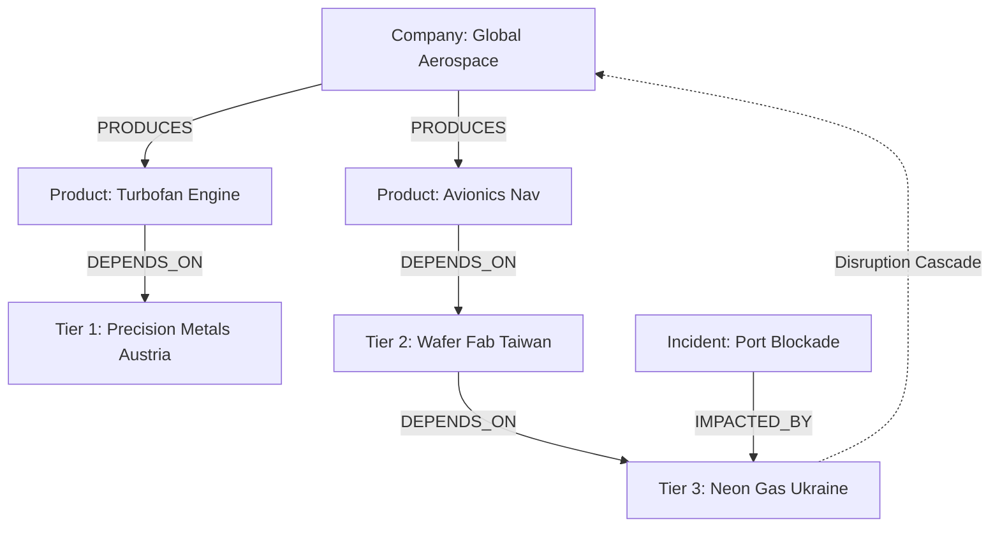

# CYPHER-KNOWLEDGE-GRAPH-REASONING
# Supply Chain Cascade Blast Radius Engine (Cypher / Neo4j)

## Executive Overview
An enterprise graph analytics engine written in **Cypher** for the **Neo4j** graph database. It models multi-tier global supply chain ontologies (OEMs, sub-assemblies, tier-1/2/3 suppliers, shipping lanes) and computes disruption cascade blast radii and revenue-at-risk when geopolitical or logistical bottlenecks occur.

## Knowledge Graph Topology



### Source Tree
- **`queries/ontology_schema.cql`**: Uniqueness constraints and graph node/edge definitions.
- **`queries/seed_graph.cql`**: Seed data populating companies, products, suppliers, and incident nodes.
- **`queries/supply_chain_blast_radius.cql`**: Variable-length graph traversal queries calculating cascade revenue-at-risk.
- **`runner/run.js`**: Embedded in-memory graph traversal harness validating blast radius algorithms.

## Cypher Blast Radius Query Excerpt
```cypher
MATCH (inc:Incident {id: 'INC-2026-GEO-01'})<-[:IMPACTED_BY]-(disrupted:Supplier)
MATCH path = (disrupted)<-[:DEPENDS_ON*1..5]-(prod:Product)<-[:PRODUCES]-(c:Company)
RETURN c.name, prod.name, sum(prod.unitMargin) AS RevenueAtRisk
```

## Native Neo4j Deployment
```bash
cypher-shell -u neo4j -p password < queries/ontology_schema.cql
cypher-shell -u neo4j -p password < queries/seed_graph.cql
cypher-shell -u neo4j -p password < queries/supply_chain_blast_radius.cql
```

## Universal Verification
```bash
node runner/run.js
node orchestrator/run.js --project=15-cypher
```

## Senior Interview Q&A
- **Q: Why use graph traversals over relational SQL joins?** Tracking multi-tier dependencies (e.g. Tier-1 down to Tier-5 raw materials) requires recursive CTEs or $N$-table joins in SQL, which degrade exponentially. Cypher performs index-free adjacency traversals in $O(k)$ time where $k$ is the number of incident edges.
- **Q: How is cycle detection handled in graph paths?** Cypher enforces relationship uniqueness by default along single path traversals, preventing infinite loops in circular supply networks.\n
